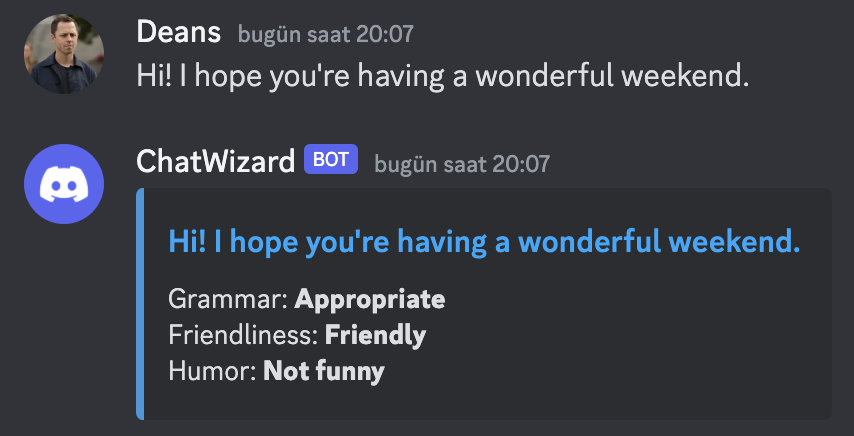

# ChatWizard
Discord bot to encourage positiveness within a server by analyzing and scoring each member's behavior.


[](https://github.com/ulasonat/ChatWizard/actions/workflows/build.yml)
[](https://codecov.io/gh/ulasonat/ChatWizard)
[](https://pypi.org/project/chatwizard/)
[](https://chatwizard.readthedocs.io/en/doc_website/?badge=doc_website)


## Overview

ChatWizard is a Discord bot that encourages positivity within a server by analyzing and scoring each member's behavior. It uses OpenAI's GPT-3.5-turbo to assess members based on factors such as helpfulness, language use, friendliness, and humor. With ChatWizard, you can create a more welcoming, engaging, and supportive environment for everyone in your server.

## Features

- Analyzes and scores server members based on grammar, friendliness, and humor values of their messages.
- Encourages and rewards positive contributions to the server.
- Provides a score breakdown so members can see how they're performing in each category.
- Logs all messages sent, making it easy to review member behavior.

## Demo



## Dependencies 
1. Python 3.6 or higher
2. `discord.py` module (v1.7.3 or higher)
3. `openai` module (v0.11.1 or higher)
4. OpenAI API key (v4)
5. A Discord user account and server

## Installation

1. Clone this repository:
```bash
git clone https://github.com/ulasonat/ChatWizard.git
```

2. Install the required third-party packages:
```bash
pip install discord
pip install openai
```

3. Set up the following environment variables, replacing `your_discord_api_key` and `your_openai_api_key` with your actual API keys:

   For bash:
   ```bash
   export DISCORD_API_KEY="your_discord_api_key"
   export OPENAI_API_KEY="your_openai_api_key"
   ```

   For Windows cmd:
   ```cmd
   set DISCORD_API_KEY="your_discord_api_key"
   set OPENAI_API_KEY="your_openai_api_key"
   ```
4. Invite the bot to your server through Discord Developer Portal.

5. Usage

To run the application, execute the following command in your terminal/cmd prompt:
``` bash
python main.py <openai_api_key> <discord_api_key>
```

Alternatively, you can import the library and call the main.run function by passing the Discord API key, OpenAI API key as arguments. Then, run the bot using the `run` method.

```python
run(discord_api_key, openai_api_key)
```

Moreover, you can have instances of either OpenAIHandler or DiscordBot classes, and use the functions available.
If you want to use our library to get a humor score for the sentence, you can do the following:

```python
from openai_handler import OpenAIHandler

openai_handler = OpenAIHandler(
    api_key=open_ai_api_key,
    grammar_prompt_path=grammar_prompt_path,
    friendliness_prompt_path=friendliness_prompt_path,
    humor_prompt_path=humor_prompt_path,
)

worst_joke_ever = 'Why did the tomato turn red? Because it saw the salad dressing!'

humor_score = openai_handler.get_humor_score(worst_joke_ever)
```

More examples are included in our project's website.

## Bot Commands

- To get help: `!help`
- To view your scores: `!me`
- To reset your scores: `!reset`

After sending a message, ChatWizard will reply with an embed showing the score breakdown for that message.

## Contributing

Contributions are welcome! Please feel free to submit a pull request for any bug fixes or new features you would like to add. 
Check the ```CONTRIBUTING.md``` for details!
